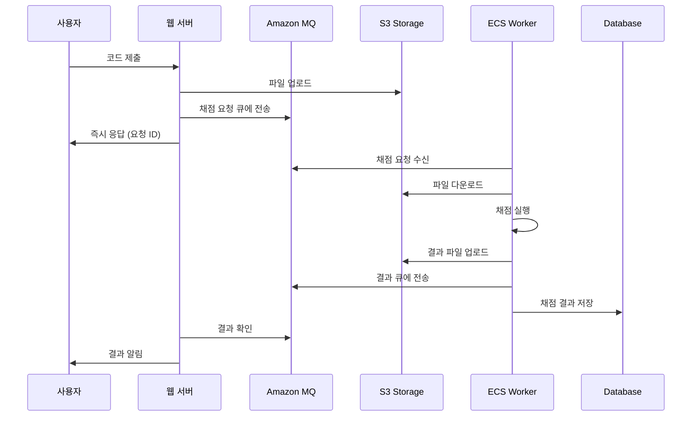

# 비동기 채점 시스템 (Async Grading System)

이 문서는 3-tier 웹 아키텍처에 통합된 비동기 채점 시스템의 상세한 구조와 사용법을 설명합니다.

## 📋 목차

- [시스템 개요](#시스템-개요)
- [아키텍처 구성](#아키텍처-구성)
- [워크플로우](#워크플로우)
- [모듈 상세](#모듈-상세)
- [설정 가이드](#설정-가이드)
- [개발 가이드](#개발-가이드)
- [모니터링](#모니터링)
- [문제 해결](#문제-해결)

## 시스템 개요

비동기 채점 시스템은 웹 애플리케이션에서 제출된 코드나 과제를 백그라운드에서 처리하는 시스템입니다. 사용자는 즉시 응답을 받고, 실제 채점은 별도의 워커 프로세스에서 비동기적으로 처리됩니다.

### 주요 특징

- ⚡ **비동기 처리**: 사용자 경험 향상을 위한 즉시 응답
- 🔄 **확장성**: 작업량에 따른 자동 스케일링
- 🛡️ **안정성**: 메시지 큐를 통한 작업 보장
- 📊 **모니터링**: 실시간 작업 상태 추적
- 🗂️ **파일 관리**: S3를 통한 안전한 파일 저장

### 사용 사례

- 코딩 테스트 플랫폼
- 온라인 저지 시스템
- 과제 제출 및 채점 시스템
- 문서 처리 시스템
- 이미지/비디오 처리 시스템

## 아키텍처 구성

```
┌─────────────────┐    ┌─────────────────┐    ┌─────────────────┐
│   Web Tier      │    │  Message Tier   │    │ Processing Tier │
│                 │    │                 │    │                 │
│ ┌─────────────┐ │    │ ┌─────────────┐ │    │ ┌─────────────┐ │
│ │     ALB     │ │    │ │ Amazon MQ   │ │    │ │ ECS Fargate │ │
│ └─────────────┘ │    │ │ (ActiveMQ)  │ │    │ │   Tasks     │ │
│ ┌─────────────┐ │    │ └─────────────┘ │    │ └─────────────┘ │
│ │   EC2 ASG   │ │    │                 │    │ ┌─────────────┐ │
│ └─────────────┘ │    │                 │    │ │Auto Scaling │ │
└─────────────────┘    └─────────────────┘    │ └─────────────┘ │
         │                       │             └─────────────────┘
         │                       │                       │
         ▼                       ▼                       ▼
┌─────────────────┐    ┌─────────────────┐    ┌─────────────────┐
│   Data Tier     │    │  Config Tier    │    │  Storage Tier   │
│                 │    │                 │    │                 │
│ ┌─────────────┐ │    │ ┌─────────────┐ │    │ ┌─────────────┐ │
│ │ RDS MySQL   │ │    │ │ SSM Params  │ │    │ │ S3 Bucket   │ │
│ └─────────────┘ │    │ └─────────────┘ │    │ └─────────────┘ │
└─────────────────┘    └─────────────────┘    └─────────────────┘
```

### 구성 요소

| 구성 요소 | 서비스 | 역할 |
|-----------|--------|------|
| **Web Tier** | ALB + EC2 | 사용자 요청 처리, 채점 요청 생성 |
| **Message Tier** | Amazon MQ | 채점 요청/결과 큐 관리 |
| **Processing Tier** | ECS Fargate | 실제 채점 작업 수행 |
| **Storage Tier** | S3 | 채점 파일 및 결과 저장 |
| **Config Tier** | SSM Parameter Store | 설정 및 자격 증명 관리 |
| **Data Tier** | RDS MySQL | 채점 결과 메타데이터 저장 |

## 워크플로우

### 1. 채점 요청 흐름



### 2. 메시지 구조

#### 채점 요청 메시지
```json
{
  "requestId": "req_123456789",
  "userId": "user_001",
  "problemId": "prob_001",
  "language": "python",
  "sourceFile": "s3://bucket/submissions/req_123456789/solution.py",
  "testCases": "s3://bucket/problems/prob_001/testcases/",
  "timeLimit": 5000,
  "memoryLimit": 256,
  "timestamp": "2024-08-20T12:00:00Z"
}
```

#### 채점 결과 메시지
```json
{
  "requestId": "req_123456789",
  "status": "completed",
  "result": {
    "verdict": "AC",
    "score": 100,
    "executionTime": 1250,
    "memoryUsage": 128,
    "testResults": [
      {"case": 1, "status": "AC", "time": 250, "memory": 64},
      {"case": 2, "status": "AC", "time": 300, "memory": 72}
    ]
  },
  "resultFile": "s3://bucket/results/req_123456789/result.json",
  "timestamp": "2024-08-20T12:00:15Z"
}
```

## 모듈 상세

### Storage 모듈 (`modules/storage/`)

S3 버킷을 관리하여 채점 관련 파일들을 저장합니다.

#### 주요 기능
- **버킷 구조**: 제출 파일, 테스트 케이스, 결과 파일 분리 저장
- **암호화**: AES-256 서버 사이드 암호화
- **버전 관리**: 파일 변경 이력 추적
- **라이프사이클**: 자동 아카이빙 및 삭제

#### 버킷 구조
```
s3://환경명-grading-files/
├── submissions/          # 제출된 코드 파일
│   └── {requestId}/
│       ├── solution.py
│       └── metadata.json
├── problems/            # 문제 및 테스트 케이스
│   └── {problemId}/
│       ├── description.md
│       └── testcases/
├── results/             # 채점 결과
│   └── {requestId}/
│       ├── result.json
│       └── execution.log
└── temp/               # 임시 파일 (자동 삭제)
```

### Messaging 모듈 (`modules/messaging/`)

Amazon MQ를 사용하여 메시지 큐 시스템을 구성합니다.

#### 주요 기능
- **ActiveMQ 브로커**: 안정적인 메시지 전달
- **큐 구성**: 채점 요청 큐, 결과 큐, DLQ (Dead Letter Queue)
- **보안**: VPC 내부 통신, 인증 필요
- **모니터링**: CloudWatch 로그 및 메트릭

#### 큐 구성
```
ActiveMQ Broker
├── grading-requests     # 채점 요청 큐
├── grading-results      # 채점 결과 큐
├── grading-dlq         # 실패한 메시지 큐
└── grading-priority    # 우선순위 채점 큐 (선택적)
```

#### 연결 정보 (SSM Parameters)
- `/환경명/mq/broker-endpoint`: MQ 브로커 엔드포인트
- `/환경명/mq/username`: MQ 사용자명
- `/환경명/mq/password`: MQ 비밀번호 (SecureString)

### ECS Grading 모듈 (`modules/ecs-grading/`)

ECS Fargate를 사용하여 채점 워커를 실행합니다.

#### 주요 기능
- **컨테이너 실행**: Fargate를 통한 서버리스 컨테이너
- **오토 스케일링**: CPU/메모리 사용률 기반 자동 확장
- **서비스 디스커버리**: 내부 서비스 간 통신 (선택적)
- **로깅**: CloudWatch Logs 통합

#### 태스크 구성
```yaml
Task Definition:
  Family: 환경명-grading-task
  CPU: 512 (0.5 vCPU)
  Memory: 1024 MB
  Network Mode: awsvpc
  
  Container:
    Name: grading-worker
    Image: your-registry/grading-service:latest
    Environment:
      - ENVIRONMENT=환경명
      - AWS_REGION=ap-northeast-2
      - MQ_ENDPOINT_PARAM=/환경명/mq/broker-endpoint
      - GRADING_BUCKET=환경명-grading-files
      - QUEUE_NAME=grading-requests
```

#### IAM 권한
ECS 태스크는 다음 권한을 가집니다:
- SSM Parameter Store 읽기
- S3 버킷 읽기/쓰기
- CloudWatch Logs 쓰기

## 설정 가이드

### 1. 기본 설정

```hcl
# terraform.tfvars
environment_name = "production"

# MQ 설정
mq_engine_type = "ActiveMQ"
mq_instance_type = "mq.t3.micro"
mq_admin_username = "admin"
mq_admin_password = "secure-password-123!"

# ECS 설정
grading_container_image = "your-registry/grading-service:v1.0.0"
use_fargate = true
ecs_desired_count = 2
enable_ecs_autoscaling = true
ecs_min_capacity = 1
ecs_max_capacity = 10
```

### 2. 고급 설정

#### 성능 튜닝
```hcl
# 고성능 설정
ecs_task_cpu = "1024"      # 1 vCPU
ecs_task_memory = "2048"   # 2GB RAM
ecs_cpu_target_value = 60  # 낮은 CPU 임계값으로 빠른 스케일링
```

#### 비용 최적화
```hcl
# 비용 최적화 설정
mq_deployment_mode = "SINGLE_INSTANCE"
ecs_desired_count = 1
ecs_max_capacity = 5
enable_s3_lifecycle = true
s3_lifecycle_expiration_days = 90
```

### 3. 보안 설정

```hcl
# 보안 강화
enable_ssh_access = false
enable_ecs_alb_access = false
mq_enable_audit_logs = true
enable_s3_versioning = true
```

## 개발 가이드

### 1. 채점 서비스 컨테이너 개발

#### Dockerfile 예시
```dockerfile
FROM python:3.9-slim

WORKDIR /app

# 의존성 설치
COPY requirements.txt .
RUN pip install -r requirements.txt

# 애플리케이션 코드
COPY src/ .

# 헬스체크
HEALTHCHECK --interval=30s --timeout=5s --start-period=60s \
  CMD curl -f http://localhost:8080/health || exit 1

EXPOSE 8080
CMD ["python", "grading_worker.py"]
```

#### 채점 워커 예시 (Python)
```python
import json
import boto3
import stomp
from typing import Dict, Any

class GradingWorker:
    def __init__(self):
        self.s3 = boto3.client('s3')
        self.ssm = boto3.client('ssm')
        self.setup_mq_connection()
    
    def setup_mq_connection(self):
        # SSM에서 MQ 연결 정보 가져오기
        endpoint = self.get_parameter('/prod/mq/broker-endpoint')
        username = self.get_parameter('/prod/mq/username')
        password = self.get_parameter('/prod/mq/password')
        
        # ActiveMQ 연결
        self.conn = stomp.Connection([(endpoint, 61613)])
        self.conn.connect(username, password, wait=True)
    
    def get_parameter(self, name: str) -> str:
        response = self.ssm.get_parameter(Name=name, WithDecryption=True)
        return response['Parameter']['Value']
    
    def process_grading_request(self, message: Dict[str, Any]):
        request_id = message['requestId']
        
        try:
            # 1. S3에서 소스 파일 다운로드
            source_code = self.download_source_file(message['sourceFile'])
            
            # 2. 채점 실행
            result = self.execute_grading(source_code, message)
            
            # 3. 결과를 S3에 업로드
            result_url = self.upload_result(request_id, result)
            
            # 4. 결과 큐에 메시지 전송
            self.send_result(request_id, result, result_url)
            
        except Exception as e:
            self.handle_error(request_id, str(e))
    
    def execute_grading(self, source_code: str, request: Dict[str, Any]) -> Dict[str, Any]:
        # 실제 채점 로직 구현
        # 예: 코드 컴파일, 테스트 케이스 실행, 결과 수집
        pass
```

### 2. 웹 애플리케이션 통합

#### 채점 요청 전송 (Node.js 예시)
```javascript
const AWS = require('aws-sdk');
const stomp = require('stomp-client');

class GradingService {
    constructor() {
        this.s3 = new AWS.S3();
        this.ssm = new AWS.SSM();
        this.setupMQConnection();
    }
    
    async submitForGrading(userId, problemId, sourceCode, language) {
        const requestId = this.generateRequestId();
        
        try {
            // 1. 소스 코드를 S3에 업로드
            const sourceFileUrl = await this.uploadSourceFile(requestId, sourceCode);
            
            // 2. 채점 요청 메시지 생성
            const request = {
                requestId,
                userId,
                problemId,
                language,
                sourceFile: sourceFileUrl,
                timeLimit: 5000,
                memoryLimit: 256,
                timestamp: new Date().toISOString()
            };
            
            // 3. MQ에 요청 전송
            await this.sendToQueue('grading-requests', request);
            
            return { requestId, status: 'submitted' };
            
        } catch (error) {
            console.error('Grading submission failed:', error);
            throw error;
        }
    }
    
    async getGradingResult(requestId) {
        // 결과 큐에서 결과 확인 또는 데이터베이스에서 조회
        return await this.checkResultQueue(requestId);
    }
}
```

## 모니터링

### 1. CloudWatch 메트릭

#### ECS 메트릭
- `CPUUtilization`: CPU 사용률
- `MemoryUtilization`: 메모리 사용률
- `TaskCount`: 실행 중인 태스크 수
- `ServiceEvents`: 서비스 이벤트

#### MQ 메트릭
- `QueueSize`: 큐에 대기 중인 메시지 수
- `ConsumerCount`: 연결된 컨슈머 수
- `EnqueueCount`: 큐에 추가된 메시지 수
- `DequeueCount`: 큐에서 처리된 메시지 수

#### S3 메트릭
- `BucketSizeBytes`: 버킷 크기
- `NumberOfObjects`: 객체 수
- `AllRequests`: 총 요청 수

### 2. 알람 설정

```hcl
# CloudWatch 알람 예시
resource "aws_cloudwatch_metric_alarm" "grading_queue_size" {
  alarm_name          = "grading-queue-size-high"
  comparison_operator = "GreaterThanThreshold"
  evaluation_periods  = "2"
  metric_name         = "QueueSize"
  namespace           = "AWS/AmazonMQ"
  period              = "300"
  statistic           = "Average"
  threshold           = "100"
  alarm_description   = "Grading queue size is too high"
  
  dimensions = {
    Broker = aws_mq_broker.grading_queue.broker_name
    Queue  = "grading-requests"
  }
}
```

### 3. 로그 분석

#### ECS 로그 패턴
```
[2024-08-20 12:00:00] INFO: Processing request req_123456789
[2024-08-20 12:00:01] INFO: Downloaded source file from S3
[2024-08-20 12:00:05] INFO: Grading completed - Result: AC, Score: 100
[2024-08-20 12:00:06] INFO: Result uploaded to S3
[2024-08-20 12:00:07] INFO: Result sent to queue
```

#### 로그 쿼리 예시 (CloudWatch Insights)
```sql
fields @timestamp, @message
| filter @message like /ERROR/
| sort @timestamp desc
| limit 100
```

## 문제 해결

### 1. 일반적인 문제

#### 채점 요청이 처리되지 않음
**증상**: 큐에 메시지가 쌓이지만 처리되지 않음
**원인**: ECS 태스크가 실행되지 않거나 MQ 연결 실패
**해결**:
1. ECS 서비스 상태 확인
2. 보안 그룹 설정 확인
3. SSM 파라미터 값 확인

#### 채점 결과가 반환되지 않음
**증상**: 채점은 완료되지만 결과를 받을 수 없음
**원인**: 결과 큐 설정 오류 또는 권한 문제
**해결**:
1. 결과 큐 존재 여부 확인
2. IAM 권한 확인
3. 네트워크 연결 상태 확인

### 2. 성능 문제

#### 채점 속도가 느림
**해결 방법**:
- ECS 태스크 리소스 증가
- 오토 스케일링 임계값 조정
- 병렬 처리 수 증가

#### 메모리 부족 오류
**해결 방법**:
- 태스크 메모리 할당량 증가
- 메모리 사용량 최적화
- 가비지 컬렉션 튜닝

### 3. 디버깅 도구

#### ECS 태스크 로그 확인
```bash
aws logs get-log-events \
  --log-group-name /ecs/3tier-grading \
  --log-stream-name grading-worker/grading-worker/task-id
```

#### MQ 큐 상태 확인
```bash
# ActiveMQ 웹 콘솔 접속
# https://mq-broker-endpoint:8162/admin/
```

#### S3 파일 확인
```bash
aws s3 ls s3://3tier-grading-files/submissions/ --recursive
```

## 추가 리소스

- [Amazon MQ 개발자 가이드](https://docs.aws.amazon.com/amazon-mq/)
- [ECS Fargate 사용자 가이드](https://docs.aws.amazon.com/AmazonECS/latest/userguide/what-is-fargate.html)
- [ActiveMQ 문서](https://activemq.apache.org/documentation)
- [STOMP 프로토콜](https://stomp.github.io/)

---

📝 **참고**: 이 문서는 지속적으로 업데이트됩니다. 최신 버전은 GitHub 저장소에서 확인하세요.
